# Database Table

## 1. MM Module

### 1.1 物料主数据

| Table                                     | Description        |
| ----------------------------------------- | ------------------ |
| [MARA](# 1.1.1 物料常规数据 - MARA)       | 常规物料数据       |
| [MARC](# 1.1.2 物料的工厂数据 - MARC)     | 物料的工厂数据     |
| [MARD](# 1.1.3 物料的仓储位置数据 - MARD) | 物料的仓储位置数据 |
| [MARM](# 1.1.4 物料的计量单位 - MARM)     | 物料的计量单位     |
| MARV                                      | 物料控制记录       |
| MBEW                                      | 物料评估           |
| MAKT                                      | 物料说明           |
| MAST                                      | BOM连接物料        |
| MVKE                                      | 物料销售数据       |
| MAPR                                      | 有关预测的物料索引 |
| MSTA                                      | 物料主记录状态     |

#### 1.1.1 物料常规数据 - MARA

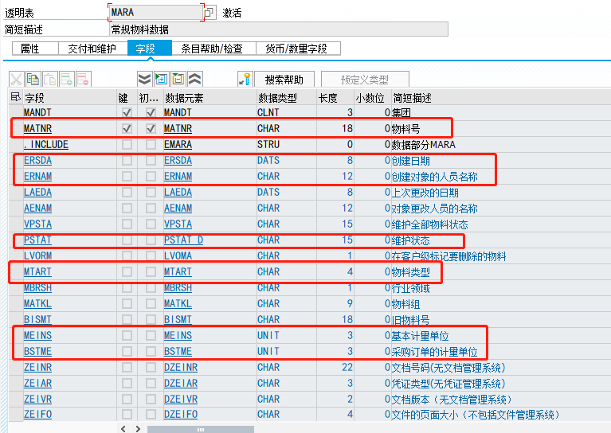

#### 1.1.2 物料的工厂数据 - MARC

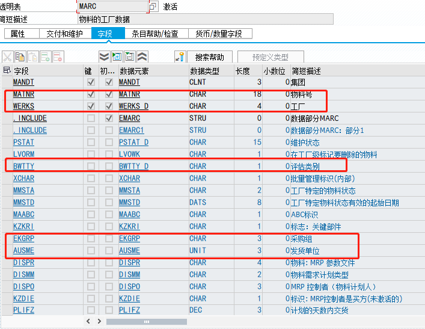

#### 1.1.3 物料的仓储位置数据 - MARD

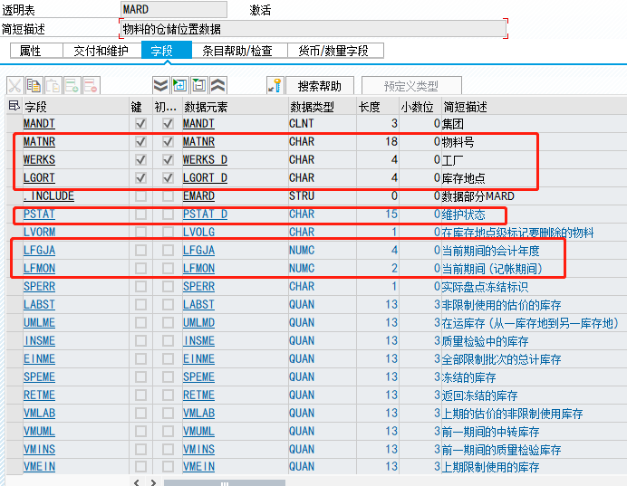

#### 1.1.4 物料的计量单位 - MARM

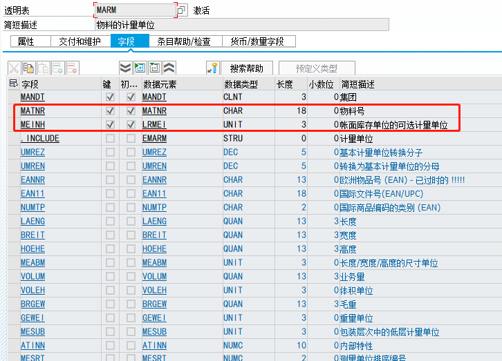

---

### 1.2 供应商主数据

| Table | Description                          |
| ----- | ------------------------------------ |
| LFA1  | 供应商主数据(一般地区)               |
| LFAS  | 供应商主数据(增值税登记号的一般部分) |
| LFAT  | 供应商主数据(税务分组)               |
| LFB1  | 供应商主数据(公司代码)               |
| LFB5  | 供应商主数据(催款数据)               |
| LFBK  | 供应商主数据(银行细目)               |
| LFBW  | 供应商主记录(预扣税类型)X            |
| LFC1  | 供应商主数据(业务额)                 |
| LFC3  | 主供应商(特殊总分类帐交易图表)       |
| LFCPR | 每一步骤的功能代码参数文件           |
| LFM1  | 供应商主记录购买组织数据             |
| LFM2  | 供应商主文件记录:采购数据            |

### 1.3 信息记录

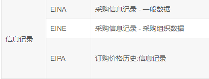

### 1.4 货源清单

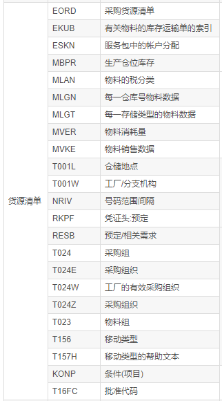

### 1.5 客户主数据

​	                                                          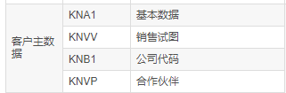

### 1.6 信用主数据

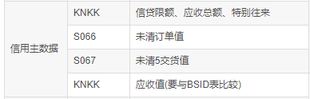

### 1.7 价格数据

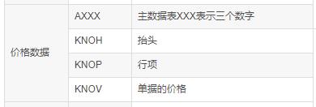

### 1.8 销售订单

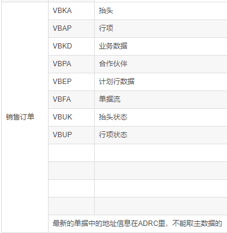

### 1.9 PR

### 1.10 PO

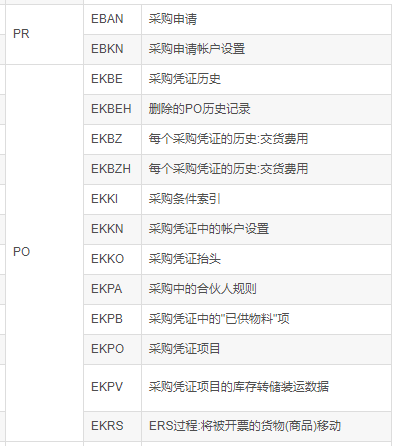

### 1.11 凭证

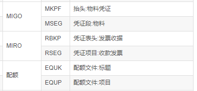

### 1.12 装运

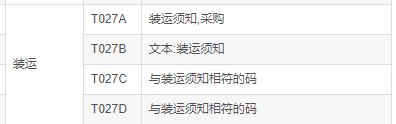

### 1.13 批次

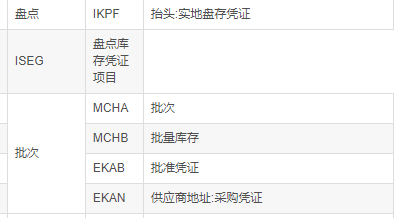

### 1.14 计划协议

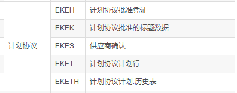

### 1.15 转储

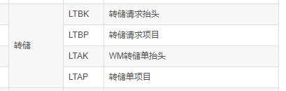

### 1.16 库存

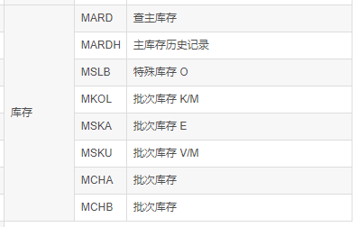

### 1.17 交货

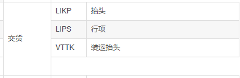

### 1.18 xx

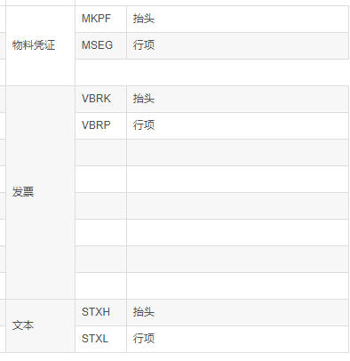

---

## 2. Demo

